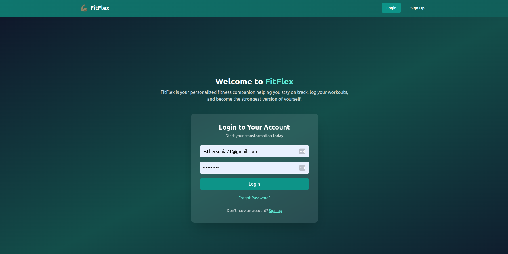
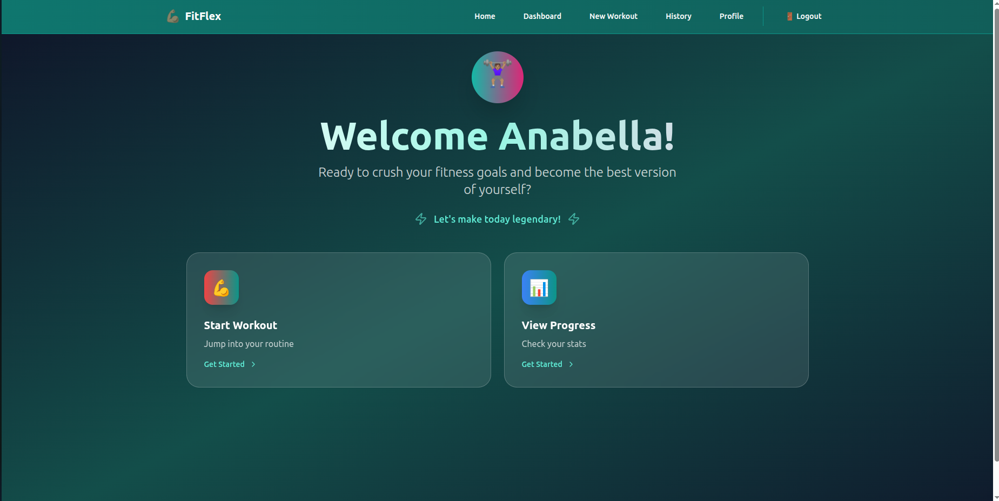
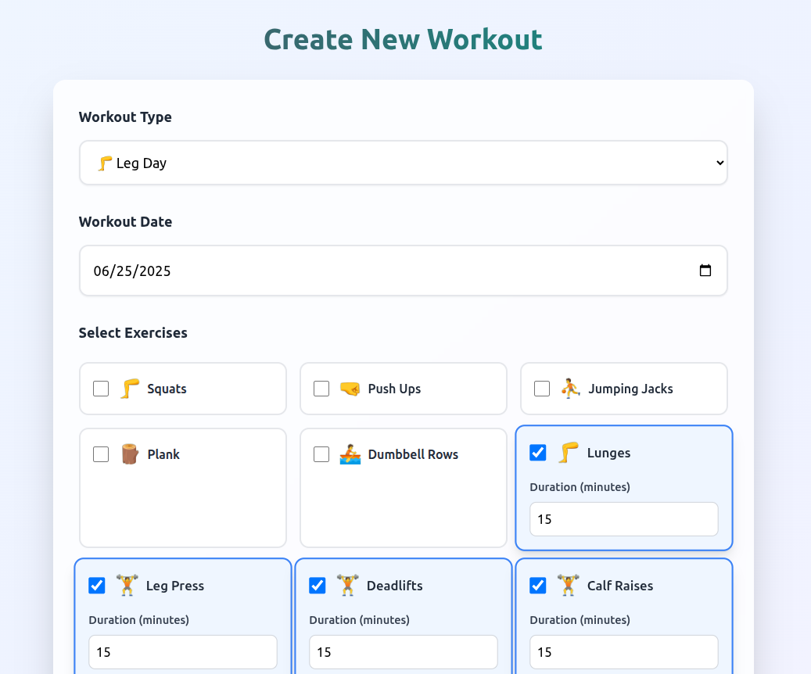

# 🏋️‍♀️ FitFlex Fitness Tracker

**FitFlex** is a full-stack fitness tracking app that allows users to create, manage, and view workouts and exercises. It helps users stay consistent and accountable in their fitness journey by tracking progress over time through visual stats and workout history.


##  Live Demo

🌐 [Click here to try FitFlex](https://fitflex-tracker-app.onrender.com/)

## Backend render link

https://fitflex-tracker-app-backend.onrender.com

## 📸 Screenshots


### Login page


###  Home page


###  Workout Form


---

## ✨ Features

- User registration & login (JWT Authentication)
- Protected routes using token authentication
- Create and customize workouts with multiple exercises
- View workout history and details
- Track progress with interactive charts (e.g.Line Chart for workout categories)
-  Edit or delete workouts
-  Reset password functionality via email

---

## 🧱 Tech Stack

### Frontend:
- React
- React Router
- Recharts / Chart.js
- Tailwind CSS

### Backend:
- FastAPI

- PostgreSQL

- SQLAlchemy

- Python-JOSE: For handling JSON Web Encryption (JWE), JSON Web Signature (JWS), and JSON Web Key (JWK) in Python.

## 🛠️ Project Structure
````
Fitflex-tracker-app/
├── client/                         # React frontend
│   ├── public/                     # Static files (images, icons)
│   │   ├── landingpage.png
│   │   └── Workoutform.png
│
│   ├── src/
│   │   ├── components/             # Reusable UI components
│   │   │   ├── Navbar.js
│   │   │   └── ResetPassword.jsx
│   │
│   │   ├── pages/                  # Main pages and views
│   │   │   ├── Dashboard.js
│   │   │   ├── Home.js
│   │   │   ├── LandingPage.jsx
│   │   │   ├── Workoutform.jsx
│   │   │   ├── WorkoutHistory.jsx
│   │   │   ├── Profile.jsx
│   │   │   └── register.jsx
│   │
│   │   ├── App.jsx                 # Root component
│   │   └── index.js                # Entry point
│
│   ├── router.jsx                  # Frontend routing
│   ├── package.json                # Frontend dependencies
│
├── server/                         # FastAPI backend
│   ├── app/
│   │   ├── __init__.py
│   │   ├── config.py               # Environment config
│   │   ├── create_tables.py        # DB setup script
│   │   ├── crud.py                 # DB logic
│   │   ├── main.py                 # App entry point
│   │   ├── models.py               # DB models
│   │   ├── routes.py               # API endpoints
│   │   ├── schemas.py              # Request/response validation
│   │   └── seed.py                 # Load default exercises
│
│   ├── requirements.txt            # Backend dependencies
│   └── .env                        # Environment variables (not tracked)
│
├── README.md                       # Project documentation
           

````


##  API Endpoints

| Method | Endpoint          | Description             |
|--------|-------------------|-------------------------|
| POST   | /register          | Register new user       |
| POST   | /login             | User login              |
| POST   | /reset-password    | Send password reset link|
| POST   | /update-password   | Update user password    |
| GET   | /me                 | Get user current profile   |


### Workouts
| Method | Endpoint           | Description               |
|--------|--------------------|---------------------------|
| GET    | /workouts          | Get all user workouts     |
| POST   | /workouts          | Create new workout        |
| GET    | /workouts/{id}     | Get a specific workout    |
| PUT    | /workouts/{id}     | Update a workout          |
| DELETE | /workouts/{id}     | Delete a workout          |

### Exercises
| Method | Endpoint           | Description             |
|--------|--------------------|-------------------------|
| GET    | /exercises         | List all exercises      |
| POST   | /exercises         | Add new exercise (admin)|

### Dashboard
| Method | Endpoint           | Description             |
|--------|--------------------|-------------------------|
| GET    | /dashboard/stats	  | Workout stats overview      |
| POST   | /dashboard/time-by-type|Timebreakdown by workouttype |


## 🔐 Environment Variables

To run this project locally, add the following `.env` in your backend folder:

```env
DATABASE_URL=your_postgres_database_url
SECRET_KEY=your_jwt_secret
ALGORITHM=HS256
```


## 🛠️ Setup Instructions

1. **Clone the repository**
```bash
git clone https://github.com/Esther-Sonia/Fitflex-tracker-app.git
cd Fitflex-tracker-app
```
2. **Start the Backend**
```bash
cd server
source venv/bin/activate
pip install -r requirements.txt
uvicorn app.main:app --reload
```

3. Start the Frontend
```bash
cd client
npm install
npm start
```
## 👩🏽‍💻 Authors
Esther Muthoni Irungu
📧 esthersonia21@gmail.com

Daniel Kipngetich
📧 danielkipngetich10@gmail.com


## ❓ Support
For questions or issues, contact:

📧 Email: esthersonia21@gmail.com

📧 Email: danielkipngetich10@gmail.com


## 📜 License
This project is licensed under the MIT License.


